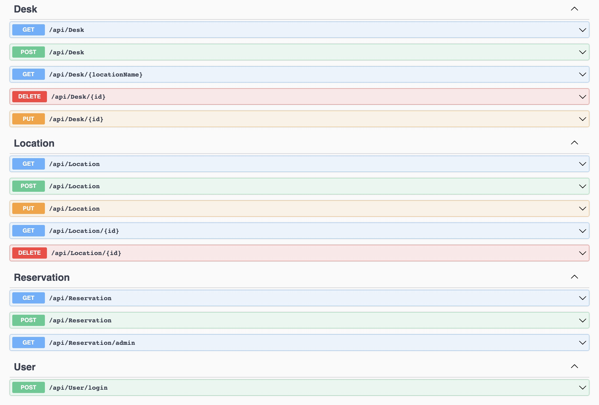

# Desk booking system API

This is an implementation of a backend system that allows users too book desks in various locations. It was buildt using C# webAPI and Entity Framework

## Functionality

The system allows for

-   Authorizing administrators and employees (via JWT)
-   Managing desk locations
-   Managing desks in a location
-   Seeing desks and their availiability
-   Booking a desk (for no more than 7 days)
-   Changing ones booking (no more than 24hrs before the current booking)
-   Seeing all desks in a certain locations
-   Seeing who booked which desk (admin only)

## How to run

To run the project You need an SQL Server instance. I used Docker for that. Then You need to provide a connection string in `/Tables/appsettings.json` in the `DefaultConnection` field. If You want to use my connection string then You need to create an SQL docker container via the command `docker run -e "ACCEPT_EULA=Y" -e "SA_PASSWORD=Admin123" -p 1433:1433 -d mcr.microsoft.com/mssql/server`.

The Code will create two sample users: admin (password = Admin123) and dominik (passowrd = dominik), who is an ordinary employee.

Then, to actually run the API You need to run `dotnet watch run --project Tables`.
That will expose the following endpoints:

Please remember about JWT when accessing them.

## Testing

Unfortunately I have only had time to write one unit test, but the Tables.Test project is fully prepared to have some more writen, when I have the time.
To run the test execute `dotnet test Tables.Test`
